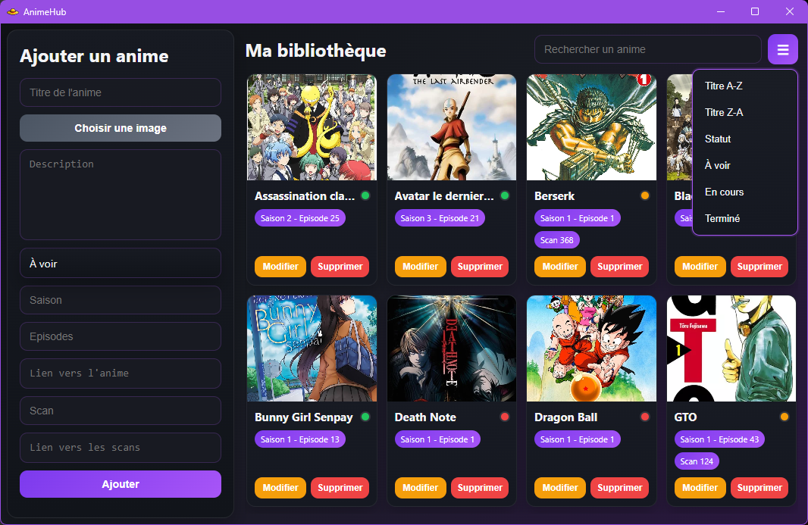

# AnimeHub

AnimeHub est une application de bureau Windows pour organiser sa bibliothèque d’animes. Elle permet de suivre ce que l’on souhaite voir, ce qui est en cours et ce qui est terminé, avec les saisons, épisodes et scans associés.



## Fonctionnalités

- Ajouter, modifier et supprimer des fiches d’anime.
- Enregistrer une image, une description, un statut, une saison, un épisode et un numéro de scan.
- Associer des liens vers un anime et vers ses scans ; les ouvrir dans le navigateur.
- Rechercher dans les titres, descriptions et statuts.
- Trier la bibliothèque par titre ou par statut.
- Conserver les fiches et images localement sur l’ordinateur.

## Installer l’application

Pour utiliser la version déjà compilée, télécharge l’installateur Windows depuis la section **Releases** du dépôt GitHub, puis lance le fichier `AnimeHub Setup <version>.exe` et suis les instructions.

Node.js et npm ne sont pas nécessaires pour installer ou utiliser cette version.

## Prérequis pour le développement

- **Windows** pour générer l’installateur Windows.
- **Node.js**, de préférence la version LTS. L’installation de Node.js inclut npm.
- **Git** pour cloner le dépôt (ou télécharge une archive du code depuis GitHub).

Liens officiels :

- [Télécharger Node.js](https://nodejs.org/fr/download)
- [Documentation de npm](https://docs.npmjs.com/)
- [Télécharger Git](https://git-scm.com/downloads)
- [Documentation d’Electron](https://www.electronjs.org/docs/latest/)

## Lancer le projet en développement

Après avoir cloné ou téléchargé le dépôt, ouvre PowerShell dans le dossier `AnimeHub` :

```powershell
npm ci
npm start
```

`npm ci` installe les versions exactes des dépendances consignées dans `package-lock.json`. La commande `npm start` démarre l’application Electron.

```powershell
git clone https://github.com/jordanbusquet/AnimeHub.git
cd AnimeHub
npm ci
npm start
```

## Générer l’installateur Windows

Depuis le dossier du projet, exécute :

```powershell
npm run build
```

Electron Builder génère les fichiers de distribution dans `dist/`, notamment un installateur de la forme `AnimeHub Setup <version>.exe`. La version affichée dans le nom vient du champ `version` de `package.json`.

## Données et sauvegardes

Les données restent sur l’ordinateur : AnimeHub ne les synchronise pas avec un serveur. Au premier démarrage, l’application crée un fichier `anime.json` et un dossier `images` dans son dossier de données utilisateur. Les images choisies sont copiées dans ce dossier.

Sous Windows, les données se trouvent généralement ici :

- Version installée : `%APPDATA%\AnimeHub`
- Mode développement : `%APPDATA%\animehub`

Pour sauvegarder ou déplacer sa bibliothèque, ferme l’application puis copie ensemble le fichier `anime.json` et le dossier `images`. Ne supprime pas ces éléments si tu souhaites conserver tes fiches et images.

## Structure du projet

```text
AnimeHub/
├── assets/          # Capture d’écran et icônes
├── src/             # Interface HTML, styles CSS et code de l’application
├── main.js          # Processus principal Electron et stockage local
├── preload.js       # Communication sécurisée entre l’interface et Electron
├── package.json     # Dépendances, commandes et configuration de compilation
└── package-lock.json
```

## Auteur

Projet développé par **Jordan BUSQUET**.
